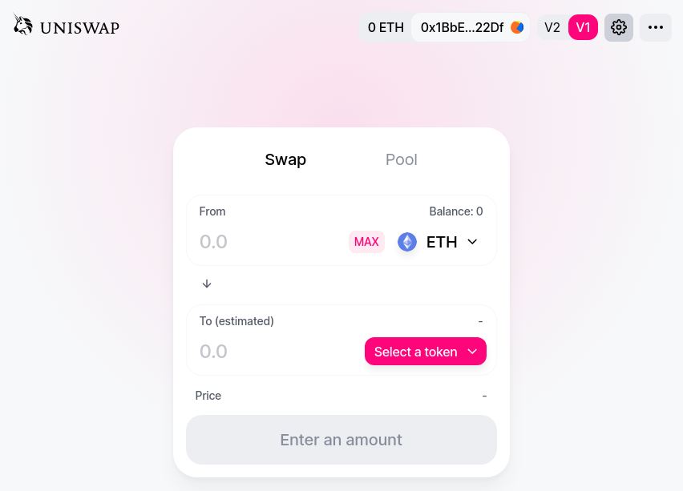

# How to deploy Uniswap V1

## Background
This article provides step-by-step instructions for installing [Uniswap](https://uniswap.org/) V1 on any [Ethereum](https://ethereum.org/en/) compatible blockchain.

Some [Ethereum](https://ethereum.org/en/) compatible blockchains include:
* [ParaTime](https://docs.oasis.dev/general/faq/oasis-network-faq) - built in collaboration by [Oasis Foundation](https://oasisprotocol.org/) & [SecondState](https://www.secondstate.io/) as announced [here](https://medium.com/oasis-protocol-project/ethereum-support-on-the-oasis-blockchain-3add9e13556).
* [CyberMiles](https://www.cybermiles.io/en-us/) - a public blockchain for E-commerce.
* [Ethereum Classic](https://ethereumclassic.org/) - Ethereum (ETH) blockchain network initially released on 30 July 2015, now known as Ethereum Classic (ETC).

### Uniswap V1
[Uniswap V1](https://uniswap.org/docs/v1/), was [launched in November 2018](https://twitter.com/haydenzadams/status/1058376395108376577) on the Ethereum mainnet as a set of 2 [Vyper](https://vyper.readthedocs.io/en/stable/) smart contracts. Uniswap is an automated liquidity protocol which facilitates token exchanges on the Ethereum blockchain network. Uniswap has seen daily trading volumes of well beyond four hundred million dollars ($400, 000, 000 / day). [This tweet](https://twitter.com/haydenzadams/status/1300034164830408704) shows that Uniswap surpasses the daily Coinbase trade volume on occasion.

#### Smart contracts
The [Factory](https://github.com/Uniswap/uniswap-v1/blob/master/contracts/uniswap_factory.vy) and [Exchange](https://github.com/Uniswap/uniswap-v1/blob/master/contracts/uniswap_exchange.vy) Vyper smart contracts of Uniswap V1 contain all of the logic for the Uniswap protocol. These smart contracts are permissionless in nature and therefore Uniswap V1 will exist for as long as Ethereum does.

## Uniswap V2
The most recent version of Uniswap, V2, includes a number of tangible improvements over V1. Uniswap V2 was [launched in May 2020](https://uniswap.org/blog/launch-uniswap-v2/) on the Ethereum mainnet [at block 10000835](https://etherscan.io/address/0x5C69bEe701ef814a2B6a3EDD4B1652CB9cc5aA6f#code) as a single [Solidity](https://github.com/ethereum/solidity) smart contract.

#### Smart contracts
Uniswap V2's [core Solidity smart contracts](https://github.com/Uniswap/uniswap-v2-core/tree/master/contracts) contain the logic which allows the Uniswap automated liquidity protocol to operate.

### Front-end
Whilst it is posible to interact with Uniswap via smart contract function executions in the command line (using a terminal), the official front-end web application provides a much nicer user experience; facilitating trading via mouse clicks and also facilitating wallet integration via browser extensions such as [Metamask](https://metamask.io/).

The image above shows the [entry point to the official Uniswap interface](https://uniswap.org/). This front end allows users on the web to switch between Uniswap V1 and Uniswap V2 using a simple `V1` `V2` toggle (as shown in the upper right corner of the image below).

## How to - user generated tokens (ERC20 compliant tokens)

Before we start deploying Uniswap, let's create some new ERC20 tokens that we can trade. This [ERC20 token source code](../erc20.sol) (which is for demo purposes only) can be compiled to generate the necessary ABI and bytecode. Let's go ahead and compile that on [remix](https://remix.ethereum.org/#optimize=false&evmVersion=null&version=soljson-v0.4.26+commit.4563c3fc.js). Simply paste the raw erc20.sol into remix and then click compile.  

## How to - Uniswap Factory and Exchange contracts

The second thing that we need to do is launch Uniswap's Factory and Exchange contracts. The following Node.js script will do this automatically for us.

